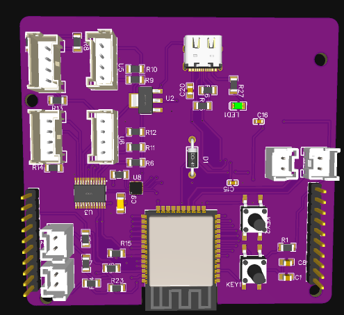

# ESP32-WROOM controller PCB
Плата контроллера, основанная на ESP32-Wrooм. Имеет соответствующие выходы и элементы, для робота. 
Плата выглядит следующим образом:

#### На плате установлены:
__Контроллер:__ ESP32-Wroom\
__IMU-сенсор:__ MPU6500\
__Мультиплексор:__ TCA9548APWR

Плата имеет размеры 76х78 мм