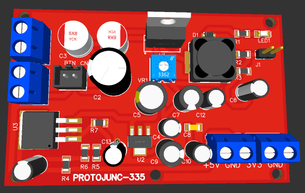

# Junction Board 4.7v
## Общее описание платы
Данная плата предназначена для распределения и стабилизации питания, которое дальше подается на микроконтроллер и микрокомпьютер.\

### Основные характеристики платы
__Входное напряжение:__ 5-40V\
__Выходное напряжение:__ 3.3V и 5V\
__Предельная сила тока__: 5А\
__Размеры:__ 100х80 мм

