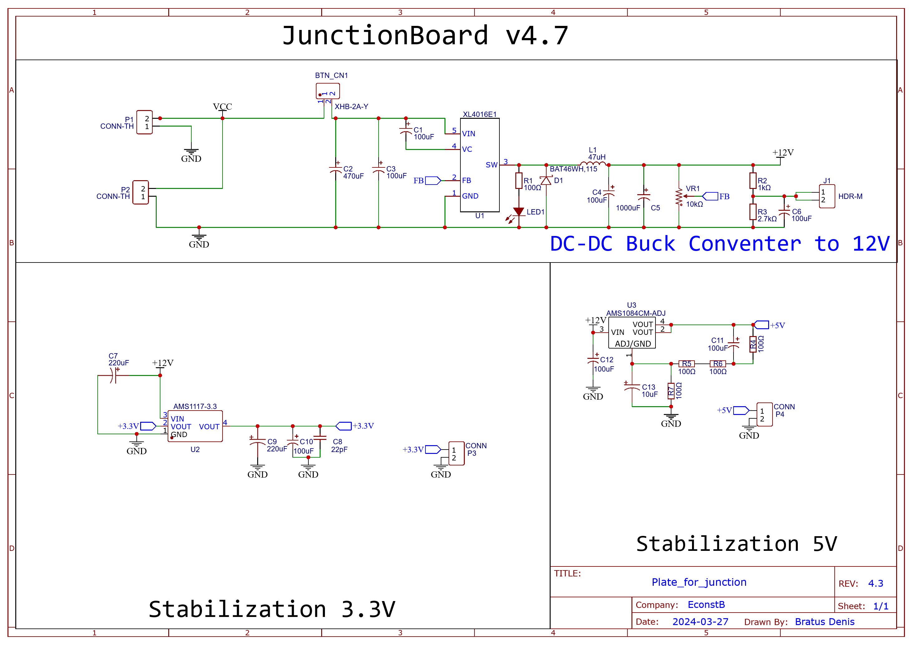

# JunctionBoard 4.7v
## Общее описание платы
Данная плата предназначена для распределения и стабилизации питания, которое дальше подается на микроконтроллер и микрокомпьютер.\

### Основные характеристики платы
__Входное напряжение:__ 5-40V\
__Выходное напряжение:__ 3.3V и 5V\
__Предельная сила тока__: 5А\
__Размеры:__ 100х80 мм
### Принципиальная Схема
Схема данной платы выглядит следующим образом. На ней расположены понижающий преобрзователь на база __XL4016__, который понижает входное напряжение, равное, 36 вольт до промежуточного значение, равное 12 вольт. После питание распределяется на два стабилизатора - __AMS1117-3.3__ и __AMS1084CM-ADJ__, на 3.3 вольт и 5 вольт соответственно.

### Список компонентов
| Name | Designator | Quantity | Place |
|---|---|---|---|
| XHB-2A-Y | BTN_CN1 | 1 | BAST |
| 100uF 50 V | C1,C3 | 2 | CHIP |
| 470uF 50 V | C2 | 1 | CHIP |
| 100uF | C4,C6,C10,C11,C12 | 5 | MY |
| 470uF | C5,C14 | 2 | MY |
| 220uF | C7,C9 | 2 | MY |
| 22pF | C8 | 1 | BAST |
| 10uF | C13 | 1 | CHIP (мин 5 pt) |
| BAT46W_C6165149 | D2 | 1 | CHIP |
| HDR-M | J1 | 1 | BAST |
| 47uH | L1 | 1 | 1000 RD |
| LED-0805_R | LED1 | 1 | BAST |
| CONN-TH | P1,P2 | 2 | BAST |
| CONN | P3,P4 | 2 | BAST |
| 100Ω | R1,R4,R5,R6,R7 | 5 | BAST |
| 1kΩ | R2 | 1 | BAST |
| 2.7kΩ | R3 | 1 | BAST |
| XL4016E1 | U1 | 1 | CHIP |
| AMS1117-3.3 | U2 | 1 | BAST |
| AMS1084CM-ADJ | U3 | 1 | CHIP |
| 10kΩ | VR1 | 1 | BAST |
