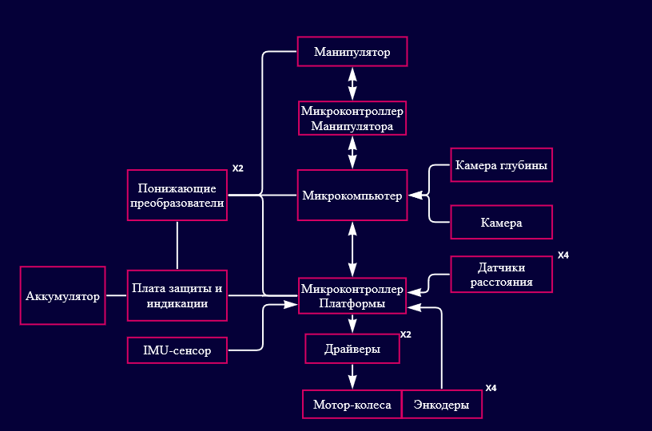
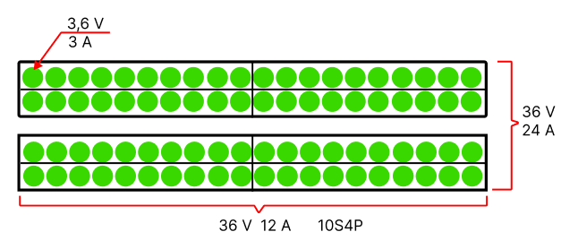
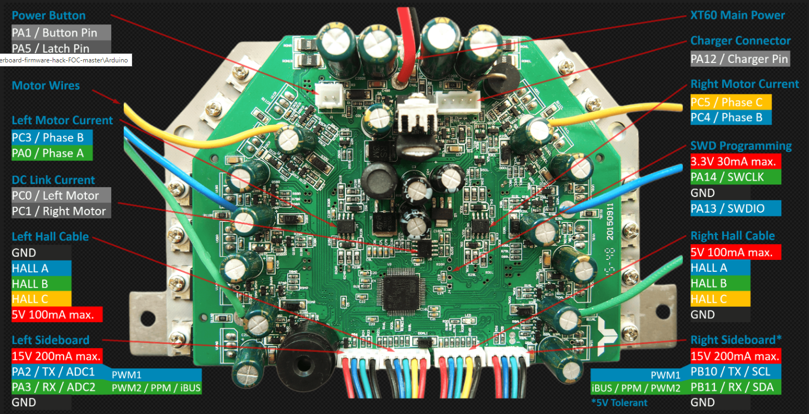

# Electronics for tomato's bot 
## Общее описание электроники робота
В роботе используются мотор-колеса для движения, и некоторые датчики для определения движения робота, а также для принятия данных внешней среды.

# Используемые модули
## Разработанные платы
### Плата распределения и стабилизации питания __JuncBoard-335 v4.7__
Плата предназначена для стабилизации питания робота от аккумуляторов 36 вольт.

__Характеристики__:

__Входное напряжение:__ 5V - 36V\
__Выходное напряжение:__ 3.3V и 5V

### Плата контроллера на ESP32-WROOM    

## Используемые готовые модули

### Сборка АКБ
Используются два аккумулятора - 36В 12Ач

### Дачтики расстояния TOF
### IMU-сенсор MPU-60xx
### Мотор-колеса и драйверы

Ссылка на проект для прошивки: https://github.com/EFeru/hoverboard-firmware-hack-FOC